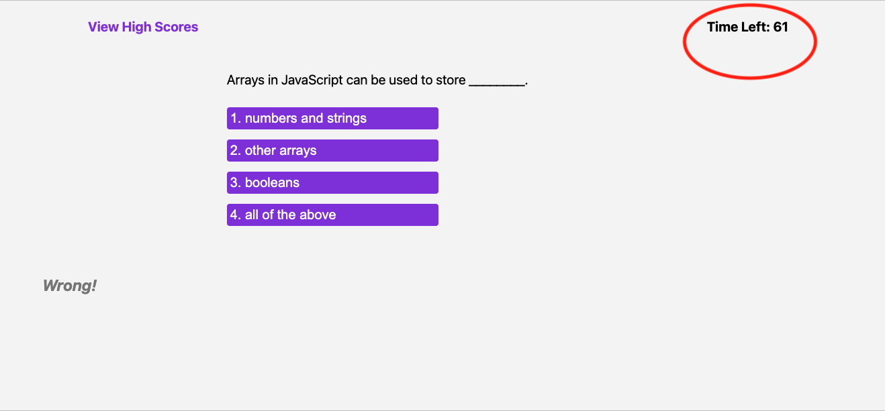

# 04 Web APIs: Code Quiz

## Description

For this unit's assignment, we are tasked to build a timed, interactive coding quiz with multiple-choice questions, for the purpose of familiarizing ourselves with coding assessments that include both multiple-choice questions and interactive coding challenges, as a part of the interview process for full-stack web developers.

In addition, this assignment aims to allow us to use the skills covered in the unit. The application will run in the browser and will feature dynamically updated HTML and CSS powered by JavaScript code that we write. It will have a clean, polished, and responsive user interface. 

## Installation

This application runs in the browser while its HTML, CSS, JS, images, and README files can be accessed through the author's GitHub repository at https://github.com/jbtiglao.

Below is the application's interface. It is deployed at the following URL: https://jbtiglao.github.io/code-quiz-challenge/.

## Usage

This application enables a coding bootcamp student (user) to take a timed quiz on Javascript fundamentals that stores high scores, so that the user can gauge the user's progress compared to the user's peers. 

In accordance with the given mock-up and required acceptance criteria, the application has the following functionalities:

* A start button the user clicks to start taking a code quiz.  The start button also starts the timer.

* When the timer starts, the use is presented with a question.

* When the user answers a question, the user is presented with another question.

* When the user is given a prompt when the user answered a question correctly or incorrectly.

* When the user answers a  question incorrectly, time is subtracted from the clock.

* When the user answers a  question incorrectly, 10 points are subtracted from the user's score.

* When all the questions are answered or when the timer reaches 0, the game is over.

* When the game is over, the user can save the user's initials and score.

* A submit button, which when clicked by the user saves the user's final score and initials. 

* All user scores are saved and can be viewed in the High Scores page.

* A Go Back button, which when clicked by the user, allows the application to reset and display the application's start page, for the user to take another code quiz.

* A Clear button, which when clicked by the user, clears all the fields containing user initials and scores on the High Scores page. 

## Credits

The following books, materials, websites, and other resources were consulted in the development of this application:

* Unit 4 lectures and handouts on Web APIs, UCI Coding Bootcamp.

* Anthony Rivas' JavaScript review, UCI Coding Bootcamp.

* Dane Shrewsbury for the help and coding guidance.

* Murach's JavaScript and jQuery 4th Edition by Mary Delamater and Zak Ruvalcaba, 2020, CA.

* https://w3schools.com and the Unit 4 Web APIs assignment mock-up for the JavaScript quiz questions. 

* MDN Web Docs for additional readings on JavaScript, Web APIs, and localStorage, and troubleshooting JavaScript questions and functionalities.

* https://stackoverflow.com for troubleshooting coding and functionalities questions on timer, localStorage, and other JS functionalities. 

* https://youtube.com for tutorials on building JavaScript Code Quiz.

## License
MIT License. Please see LICENSE on the application's GitHub repository.
